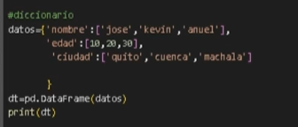

un data set se obtiene un diccionario a data set, cuya clave es la columna y sus valores la lista



```python

import pandas as pd

# Diccionario con listas
data = {
    "id": [1, 2, 3, 4],
    "edad": [23, 25, 30, 28],
    "nota": [8.5, 9.0, 7.5, 8.0]
}

# Convertir a DataFrame
df = pd.DataFrame(data)

print(df)

```

```python
data = {
    "nombre": ["Ana", "Luis", "María", "Pedro"],
    "ciudad": ["Quito", "Guayaquil", "Cuenca", "Ambato"],
    "edad": [22, 35, 29, 40]
}

df = pd.DataFrame(data)

print(df)

```


```python
data = {
    "fecha": pd.date_range("2026-04-01", periods=5),
    "ventas": [100, 120, 90, 150, 130],
    "producto": ["A", "B", "A", "C", "B"]
}

df = pd.DataFrame(data)

print(df)

```

<!-- crear data Frames -->

```python
edades=pd.Series([15,16,18,19])
```

## FECHAS

```python
fechas=pd.to_datetime(['2025-04-02','2025-04-02','2025-04-02'])

```
